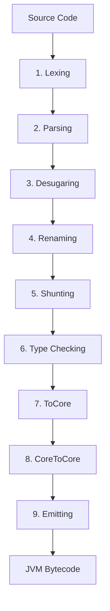

The Elara compiler transforms source code through 9 distinct passes, each building on the previous stage to ultimately produce JVM bytecode or interpret the program directly.

## Pipeline Overview

Each stage is implemented as a **query** in the Rock-based build system, allowing for lazy evaluation and memoization:



## Stage 1: Lexing

<Steps>
  <Step title="Tokenization">
    The source code is converted into a stream of tokens:
    
    ```elara
    def factorial : Int -> Int
    let factorial n = if n == 0 then 1 else n * factorial (n - 1)
    ```
    
    Becomes:
    
    ```
    DEF, IDENTIFIER("factorial"), COLON, IDENTIFIER("Int"), ARROW, IDENTIFIER("Int")
    LET, IDENTIFIER("factorial"), IDENTIFIER("n"), EQUALS, IF, ...
    ```
  </Step>
  
  <Step title="Layout Rules">
    Elara uses significant whitespace (like Haskell). The lexer converts indentation into explicit braces and semicolons:
    
    ```elara
    let main =
        print "Hello"
        print "World"
    ```
    
    Becomes:
    
    ```elara
    let main = { print "Hello"; print "World" }
    ```
  </Step>
  
  <Step title="Comment Removal">
    Single-line (`--`) and multi-line (`{- -}`) comments are stripped out.
  </Step>
</Steps>

<Note>
**Implementation**: `src/Elara/Lexer/Reader.hs`

**Query**: `LexedFile :: FilePath -> Query [Lexeme]`

**Errors**: `LexerError` - Reports illegal characters, unterminated strings, etc.
</Note>

## Stage 2: Parsing

<Steps>
  <Step title="AST Construction">
    The token stream is parsed into the **Frontend AST**, which closely mirrors the source syntax:
    
    ```haskell
    data Module Frontend = Module
      { name :: ModuleName
      , declarations :: [Declaration Frontend]
      , imports :: [Import]
      }
    ```
  </Step>
  
  <Step title="Syntax Validation">
    The parser ensures:
    - Balanced parentheses and brackets
    - Valid declaration structure (`def` followed by `let`)
    - Proper pattern match syntax
    - Well-formed type signatures
  </Step>
  
  <Step title="Error Recovery">
    Modern error recovery allows parsing to continue after errors, reporting multiple issues at once.
  </Step>
</Steps>

<Note>
**Implementation**: `src/Elara/Parse/Module.hs`, `src/Elara/Parse/Expression.hs`

**Query**: `ParsedFile :: FilePath -> Query (Module Frontend)`

**Errors**: `WParseErrorBundle` - Detailed parse errors with source locations
</Note>

### Example: Frontend AST

```elara
def factorial : Int -> Int
let factorial n = if n == 0 then 1 else n * factorial (n - 1)
```

Produces:

```haskell
ValueDeclaration
  { name = "factorial"
  , type' = Just (FunctionType Int Int)
  , value = Lambda "n" (
      If (BinaryOp "==" (Var "n") (Int 0))
         (Int 1)
         (BinaryOp "*" (Var "n") (App (Var "factorial") (BinaryOp "-" (Var "n") (Int 1))))
    )
  }
```

## Stage 3: Desugaring

<Steps>
  <Step title="Lambda Currying">
    Multi-argument lambdas become nested single-argument lambdas:
    
    ```elara
    \x y -> x + y
    ```
    
    Becomes:
    
    ```elara
    \x -> \y -> x + y
    ```
  </Step>
  
  <Step title="Let to Lambda">
    Let bindings with parameters are converted to lambda expressions:
    
    ```elara
    let add x y = x + y
    ```
    
    Becomes:
    
    ```elara
    let add = \x -> \y -> x + y
    ```
  </Step>
  
  <Step title="Declaration Merging">
    Declarations with the same name (type signature + definition) are merged into a single declaration:
    
    ```elara
    def factorial : Int -> Int
    let factorial n = ...
    ```
    
    Becomes a single `ValueDeclaration` with both type and implementation.
  </Step>
</Steps>

<Note>
**Implementation**: `src/Elara/Desugar.hs`

**Query**: `DesugaredModule :: ModuleName -> Query (Module Desugared)`

**Errors**: `DesugarError` - Mismatched declarations, duplicate definitions
</Note>

## Stage 4: Renaming

<Steps>
  <Step title="Name Resolution">
    All names are resolved to fully qualified names:
    
    ```elara
    map f xs  -- Becomes: Elara.Prelude.map f xs
    ```
  </Step>
  
  <Step title="Unique Name Generation">
    Local variables get unique identifiers to avoid shadowing:
    
    ```elara
    let f x = let x = 5 in x + x
    ```
    
    Becomes:
    
    ```elara
    let f x#1 = let x#2 = 5 in x#2 + x#2
    ```
  </Step>
  
  <Step title="Import Processing">
    Imports are resolved and the module's namespace is populated.
  </Step>
</Steps>

<Note>
**Implementation**: `src/Elara/Rename.hs`, `src/Elara/Rename/Imports.hs`

**Query**: `RenamedModule :: ModuleName -> Query (Module Renamed)`

**Errors**: `RenameError` - Undefined names, ambiguous imports, circular imports
</Note>

## Stage 5: Shunting

<Steps>
  <Step title="Operator Precedence">
    Binary operators are reassociated according to their precedence:
    
    ```elara
    1 + 2 * 3  -- Becomes: 1 + (2 * 3)
    ```
  </Step>
  
  <Step title="Operator Desugaring">
    All operators become prefix function calls:
    
    ```elara
    x + y  -- Becomes: (+) x y
    ```
  </Step>
  
  <Step title="Custom Operators">
    User-defined operators with custom fixity are handled:
    
    ```elara
    infixl 6 +$+
    let (+$+) x y = ...
    ```
  </Step>
</Steps>

<Note>
**Implementation**: `src/Elara/Shunt.hs`, `src/Elara/Shunt/Operator.hs`

**Query**: `ModuleByName @Shunted :: ModuleName -> Query (Module Shunted)`

**Errors**: `ShuntError` - Invalid operator precedence, undefined operators

**Warnings**: `ShuntWarning` - Precedence ambiguities
</Note>

## Stage 6: Type Checking

<Steps>
  <Step title="Constraint Generation">
    Type constraints are generated from the AST using **Algorithm W**:
    
    ```elara
    let id x = x
    ```
    
    Generates:
    - `x : α`
    - `id : α -> α`
  </Step>
  
  <Step title="Constraint Solving">
    Constraints are unified using **Robinson's unification algorithm**:
    - Substitution-based unification
    - Occurs check to prevent infinite types
    - Type error reporting with source locations
  </Step>
  
  <Step title="Generalization">
    Polymorphic types are generalized:
    
    ```elara
    let id x = x  -- Inferred type: ∀a. a -> a
    ```
  </Step>
  
  <Step title="Effect Tracking">
    IO effects are tracked in the type system:
    
    ```elara
    print : String -> IO ()
    ```
  </Step>
</Steps>

<Note>
**Implementation**: `src/Elara/TypeInfer.hs`, `src/Elara/TypeInfer/ConstraintGeneration.hs`

**Query**: `TypeCheckedModule :: ModuleName -> Query (Module Typed)`

**Errors**: Type mismatches, occurs check failures, infinite types, missing IO annotations
</Note>

### Type Inference Example

```elara
def map : (a -> b) -> [a] -> [b]
let map f ls =
    match ls with
        [] -> []
        x::xs -> f x :: map f xs
```

Type checking verifies:
1. `f : a -> b`
2. `ls : [a]`
3. `x : a`, `xs : [a]`
4. `f x : b`
5. `map f xs : [b]`
6. Result: `[b]` ✓

## Stage 7: ToCore

<Steps>
  <Step title="Core AST Construction">
    The Typed AST is converted to **Core**, a minimal typed lambda calculus with only 8 constructors:
    
    1. `Var` - Variables
    2. `Lam` - Lambda abstraction
    3. `App` - Function application
    4. `Let` - Let binding
    5. `Case` - Pattern matching
    6. `Lit` - Literals
    7. `Type` - Type abstraction
    8. `Cast` - Type coercion
  </Step>
  
  <Step title="Pattern Match Compilation">
    Pattern matches are compiled to efficient decision trees:
    
    ```elara
    match x with
      (a, 0) -> a
      (0, b) -> b
      (a, b) -> a + b
    ```
    
    Becomes a tree of case expressions that avoid redundant tests.
  </Step>
  
  <Step title="Extensive Desugaring">
    All high-level constructs are desugared:
    - List syntax → cons cells
    - String literals → character lists
    - Do notation → bind operations
    - Multi-way if → nested if-then-else
  </Step>
</Steps>

<Note>
**Implementation**: `src/Elara/ToCore.hs`, `src/Elara/ToCore/Match.hs`

**Query**: `GetCoreModule :: ModuleName -> Query (CoreModule CoreBind)`

**Errors**: Pattern match compilation errors, exhaustiveness checking failures
</Note>

### Example: Core IR

```elara
let factorial n = if n == 0 then 1 else n * factorial (n - 1)
```

Becomes:

```haskell
Let factorial (Lam n
  (Case (App (App (Var (==)) (Var n)) (Lit 0))
    [ (True, Lit 1)
    , (False, App (App (Var (*)) (Var n))
                  (App (Var factorial) (App (App (Var (-)) (Var n)) (Lit 1))))
    ]))
```

## Stage 8: CoreToCore

<Steps>
  <Step title="A-Normal Form (ANF)">
    Core is converted to ANF where all intermediate values are named:
    
    ```haskell
    f (g x) (h y)
    ```
    
    Becomes:
    
    ```haskell
    let a = g x in
    let b = h y in
    f a b
    ```
  </Step>
  
  <Step title="Closure Lifting">
    Nested functions are lifted to top-level with explicit environment passing:
    
    ```haskell
    let outer x =
      let inner y = x + y
      in inner
    ```
    
    Becomes:
    
    ```haskell
    let inner env y = env.x + y
    let outer x = inner {x}
    ```
  </Step>
  
  <Step title="Optimizations">
    Various Core-to-Core transformations:
    - Dead code elimination
    - Constant folding
    - Beta reduction
    - Eta reduction
    - Inlining small functions
  </Step>
</Steps>

<Note>
**Implementation**: `src/Elara/CoreToCore.hs`, `src/Elara/Core/ToANF.hs`, `src/Elara/Core/LiftClosures.hs`

**Queries**:
- `GetANFCoreModule :: ModuleName -> Query (CoreModule ANFBind)`
- `GetClosureLiftedModule :: ModuleName -> Query (CoreModule ANFBind)`
- `GetFinalisedCoreModule :: ModuleName -> Query (CoreModule CoreBind)`

**Errors**: `ClosureLiftError` - Closure conversion failures
</Note>

## Stage 9: Emitting

<Steps>
  <Step title="JVM IR Generation">
    Core is lowered to JVM IR, an intermediate representation closer to JVM bytecode:
    
    - Functions → methods
    - Lambdas → synthetic classes implementing `Func` interface
    - Pattern matches → switch statements and instanceof checks
    - Algebraic data types → Java classes with inheritance
  </Step>
  
  <Step title="Bytecode Emission">
    JVM IR is converted to actual JVM bytecode:
    
    - Method bodies → bytecode instructions
    - Type information → JVM signatures
    - Constants → constant pool entries
  </Step>
  
  <Step title="Class File Writing">
    Class files are written to the `build/` directory:
    
    ```
    build/
    └── Main.class
    ```
  </Step>
</Steps>

<Note>
**Implementation**: `src/Elara/JVM/Lower.hs`, `src/Elara/JVM/Emit.hs`

**Queries**:
- `GetJVMIRModule :: ModuleName -> Query IR.Module`
- `GetJVMClassFiles :: ModuleName -> Query [ClassFile]`
- `GetJVMClassBytes :: ModuleName -> Query [(FilePath, ByteString)]`

**Errors**: `JVMLoweringError`, `CodeConverterError` - JVM compilation failures
</Note>

### JVM Backend Details

Elara compiles to Java 8+ bytecode with the following conventions:

- **Functions**: Static methods in module classes
- **Closures**: Classes implementing `Elara.Func` interface
- **Data constructors**: Subclasses with fields
- **Pattern matching**: Visitor pattern with instanceof checks
- **IO**: Java methods with side effects

## Intermediate Output

Use `--dump` flags to inspect intermediate representations:

```bash
elara build Main.elara --dump=parsed,core,jvm
```

Generates:

```
build/
├── Main.parsed.elr      # Frontend AST
├── Main.core.elr        # Core IR
├── Main.jvm.ir.elr      # JVM IR
└── Main.classfile.txt   # JVM bytecode disassembly
```

<Tip>
Dumping intermediate stages is invaluable for debugging compiler issues and understanding how your code is transformed.
</Tip>

## Performance Notes

### Compilation Speed

- **Lexing**: Very fast (~1ms for 1000 lines)
- **Parsing**: Fast (~5ms for 1000 lines)
- **Type checking**: Moderate (~50ms for complex code)
- **Code generation**: Fast (~10ms per module)

### Optimization Passes

The CoreToCore stage can be expensive for large modules. Future versions may include:

- Parallel query execution
- Incremental type checking
- Separate compilation
- Bytecode caching

## Related Pages

<CardGroup cols={2}>
  <Card title="Compiler Architecture" icon="diagram-project" href="/compiler/architecture">
    High-level overview of compiler design
  </Card>
  <Card title="CLI Reference" icon="terminal" href="/compiler/cli-reference">
    Command-line options for compilation
  </Card>
</CardGroup>