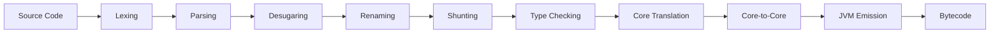

# Compiler Internals

The Elara compiler transforms source code through **9 distinct phases**, each with its own AST representation. This multi-pass architecture enables clean separation of concerns and facilitates optimization.

## Compilation Pipeline Overview



<Steps>
  <Step title="Lexing">
    Convert source text to tokens, apply layout rules
  </Step>
  <Step title="Parsing">
    Build Frontend AST from tokens
  </Step>
  <Step title="Desugaring">
    Simplify language constructs (multi-arg lambdas → nested lambdas)
  </Step>
  <Step title="Renaming">
    Resolve names, make all names unique
  </Step>
  <Step title="Shunting">
    Apply operator precedence and associativity
  </Step>
  <Step title="Type Checking">
    Infer and verify types, produce Typed AST
  </Step>
  <Step title="ToCore">
    Convert to Core IR (typed lambda calculus)
  </Step>
  <Step title="CoreToCore">
    Apply optimizations on Core IR
  </Step>
  <Step title="Emitting">
    Generate JVM bytecode
  </Step>
</Steps>

## Phase 1: Lexing

**Location**: `src/Elara/Lexer/`

The lexer converts source text into a stream of tokens and applies **lightweight syntax** rules:

### Layout Rules

Elara uses Haskell-style layout (indentation-sensitive syntax):

<Accordion title="Implicit Braces">
```elara
let x =     -- '{' inserted after '='
    1       -- At this column
    + 2     -- Same indentation, part of x
let y = 3   -- '}' inserted, dedent detected
```
</Accordion>

<Accordion title="Implicit Semicolons">
```elara
let x = 1   -- ';' inserted at newline
let y = 2   -- ';' inserted
```
</Accordion>

### Offside Rule

The lexer tracks **offside columns** where code must be aligned:

```elara
module Main       -- Marks offside column for top-level
let x = 1         -- OK: aligned with 'let'
  let y = 2       -- Error: indented too far
let z = 3         -- OK: aligned
```

<Note>
  The lexer uses a **layout stack** to track nested offside contexts (module, let, match, etc.).
</Note>

## Phase 2: Parsing

**Location**: `src/Elara/Parser/`

The parser builds the **Frontend AST**, which closely mirrors source syntax:

```haskell
data Expr' front
  = Int Integer
  | String Text
  | Var VarRef
  | Lambda (LambdaParam front) (Expr front)
  | FunctionCall (Expr front) (Expr front)
  | Let VarName (TypeAnnotation front) (Expr front)
  | LetIn VarName (TypeAnnotation front) (Expr front) (Expr front)
  | If (Expr front) (Expr front) (Expr front)
  | Match (Expr front) [(Pattern front, Expr front)]
  | Block [Expr front]
  | ...
```

Key features:
- **Operator parsing**: Infix operators like `+`, `*` are parsed as binary expressions
- **Pattern syntax**: Full support for constructor, list, tuple, and wildcard patterns
- **Type annotations**: Optional type signatures on let bindings

<Warning>
  Parsing does NOT resolve names or check types - it only verifies syntactic correctness.
</Warning>

## Phase 3: Desugaring

**Location**: `src/Elara/Desugar/`

Desugaring simplifies the AST while preserving semantics:

<Accordion title="Multi-Argument Lambdas">
```elara
-- Before
\x y z -> body

-- After
\x -> \y -> \z -> body
```
</Accordion>

<Accordion title="Let Bindings with Parameters">
```elara
-- Before
let add x y = x + y

-- After  
let add = \x -> \y -> x + y
```
</Accordion>

<Accordion title="Multiple Declarations">
Merge all `def` and `let` declarations with the same name:

```elara
def add : Int -> Int -> Int
let add x y = x + y

-- Merged into single declaration with type annotation
```
</Accordion>

<Info>
  The Desugared AST is still fairly high-level - complex desugarings (like pattern matching) happen later in ToCore.
</Info>

## Phase 4: Renaming

**Location**: `src/Elara/Rename/`

The renamer performs **name resolution** and makes all names unique:

### Name Resolution

<Steps>
  <Step title="Module Resolution">
    Resolve imports, build module dependency graph
  </Step>
  <Step title="Scope Analysis">
    Track which names are in scope at each point
  </Step>
  <Step title="Qualification">
    Convert unqualified names to fully qualified names (e.g., `map` → `Prelude.map`)
  </Step>
  <Step title="Uniquification">
    Assign unique IDs to local variables to avoid shadowing issues
  </Step>
</Steps>

### Example

```elara
import Data.List (map)

let map = \x -> x * 2  -- Local definition shadows import
let result = map [1, 2, 3]
```

After renaming:

```elara
import Data.List (map)

let map_42 = \x -> x * 2  -- Renamed to map_42
let result = map_42 [1, 2, 3]  -- Uses local map_42, not Data.List.map
```

<Note>
  The Renamed AST uses **VarRef** to distinguish global references (qualified names) from local references (unique IDs).
</Note>

## Phase 5: Shunting

**Location**: `src/Elara/Shunt/`

The shunter applies operator precedence and associativity using the **Shunting Yard algorithm**:

```elara
-- Before (flat binary expressions)
1 + 2 * 3

-- After (correct precedence)
1 + (2 * 3)
```

Operator precedence is derived from `@infix` annotations:

```elara
@infix(left, 6)
def (+) : Int -> Int -> Int

@infix(left, 7)  
def (*) : Int -> Int -> Int
```

<Warning>
  Operators without precedence annotations default to precedence 9 and emit a warning.
</Warning>

## Phase 6: Type Checking

**Location**: `src/Elara/TypeInfer/`

The type checker infers types using the Hindley-Milner algorithm:

1. **Constraint Generation**: Walk the AST, generate type equality constraints
2. **Constraint Solving**: Unify types to find a substitution
3. **Substitution Application**: Apply the substitution to produce the Typed AST

See [Type Inference](/reference/type-inference) for detailed explanation.

The output is a **Typed AST** where every expression is annotated with its type:

```haskell
data Expr' Typed = ...
type TypedExpr = Expr (Located (Expr' Typed, Monotype SourceRegion))
```

## Phase 7: ToCore Translation

**Location**: `src/Elara/Core/`

The ToCore pass converts the high-level Typed AST to **Core**, a minimal typed lambda calculus:

```haskell
data Expr bind
  = Var (Var bind)
  | Lam (Var bind) (Expr bind)
  | App (Expr bind) (Expr bind)
  | Let (CoreBind bind) (Expr bind)
  | Case (Expr bind) [Alt bind]
  | Lit Literal
  | Type Type

data CoreBind bind
  = NonRec (Var bind) (Expr bind)
  | Rec [(Var bind, Expr bind)]
```

### Major Transformations

<Accordion title="Pattern Match Compilation">
Pattern matching is desugared to case expressions with simple patterns:

```elara
match list with
  [] -> 0
  x::xs -> x + sum xs
```

Becomes:

```haskell
case list of
  Nil -> 0
  Cons x xs -> 
    let sum_xs = sum xs
    in x + sum_xs
```
</Accordion>

<Accordion title="Recursive Let Detection">
Identify and mark recursive bindings:

```elara
let fact n = if n == 0 then 1 else n * fact (n - 1)
```

Becomes:

```haskell
letrec fact = \n -> 
  case n == 0 of
    True -> 1
    False -> n * fact (n - 1)
```
</Accordion>

<Accordion title="Type Applications">
Make implicit type applications explicit:

```elara
id 42  -- id : forall a. a -> a
```

Becomes:

```haskell
id @Int 42  -- Explicit type application
```
</Accordion>

<Note>
  Core is similar to GHC's Core language and is designed for optimization.
</Note>

## Phase 8: Core-to-Core Passes

**Location**: `src/Elara/Core/`

Multiple optimization passes transform Core:

<Steps>
  <Step title="ANF Conversion">
    Convert to A-Normal Form (all subexpressions are atomic)
  </Step>
  <Step title="Closure Lifting">
    Lift nested functions to top-level, generate closure data structures
  </Step>
  <Step title="Dead Code Elimination">
    Remove unused bindings
  </Step>
  <Step title="Inlining">
    Inline small functions at call sites (future work)
  </Step>
</Steps>

### A-Normal Form (ANF)

ANF ensures all intermediate values are named:

```haskell
-- Before
f (g x) (h y)

-- After ANF
let a = g x
let b = h y
in f a b
```

This simplifies subsequent passes like closure conversion.

### Closure Lifting

Nested functions are lifted to the top level with explicit environment parameters:

```elara
let makeAdder = \x -> \y -> x + y
```

Becomes:

```haskell
-- Top-level function with environment parameter
let makeAdder_inner env y = 
  let x = env.x in x + y

-- Original function creates closure
let makeAdder x =
  let env = { x = x }
  in makeAdder_inner env
```

## Phase 9: JVM Emission

**Location**: `src/Elara/JVM/`

The final phase generates JVM bytecode:

<Steps>
  <Step title="Lower to JVM IR">
    Convert Core to high-level JVM IR (src/Elara/JVM/IR.hs)
  </Step>
  <Step title="Emit Bytecode">
    Translate IR to actual JVM instructions (src/Elara/JVM/Emit.hs)
  </Step>
  <Step title="Generate Class Files">
    Write .class files with proper constant pools and attributes
  </Step>
</Steps>

See [JVM Interop](/reference/jvm-interop) for detailed bytecode generation.

## Query System

Elara uses the **Rock** query system for incremental compilation:

```haskell
data Query a where
  ParseModule :: ModuleName -> Query (Frontend.Module)
  TypeCheck :: ModuleName -> Query (Typed.Module)
  GenerateCore :: ModuleName -> Query (Core.Module)
  EmitBytecode :: ModuleName -> Query ClassFile
```

Queries are:
- **Memoized**: Results are cached
- **Lazy**: Only computed when needed
- **Incremental**: Dependencies are tracked automatically

<Info>
  The query system enables features like "compile on demand" where only required modules are processed.
</Info>

## Debugging and Inspection

The compiler provides several debug flags:

```bash
elara compile --dump-lexed    # Show lexer output
elara compile --dump-parsed   # Show Frontend AST
elara compile --dump-renamed  # Show Renamed AST
elara compile --dump-typed    # Show Typed AST with inferred types
elara compile --dump-core     # Show Core IR
elara compile --dump-core-anf # Show Core after ANF conversion
```

Logs are written to `.elara/logs/` for inspection.

## Further Reading

- [Type Inference](/reference/type-inference) - Details on the type checking phase
- [JVM Interop](/reference/jvm-interop) - Details on bytecode generation
- [Language Specification](https://github.com/ElaraLang/elara/blob/main/specification/specification.typ) - Formal syntax and semantics
